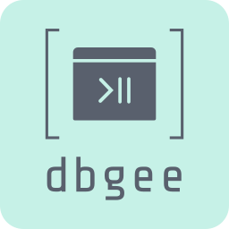
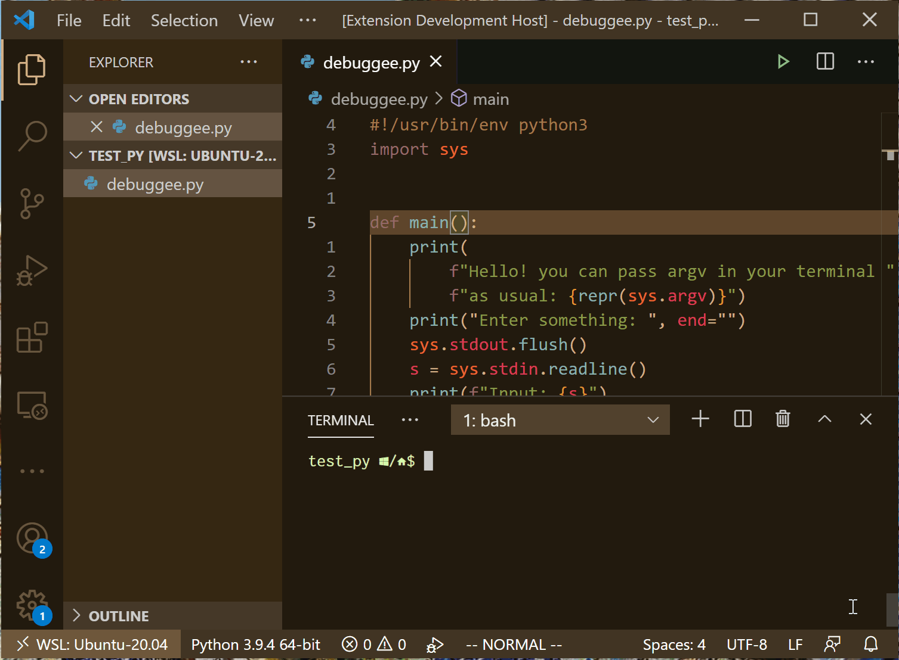
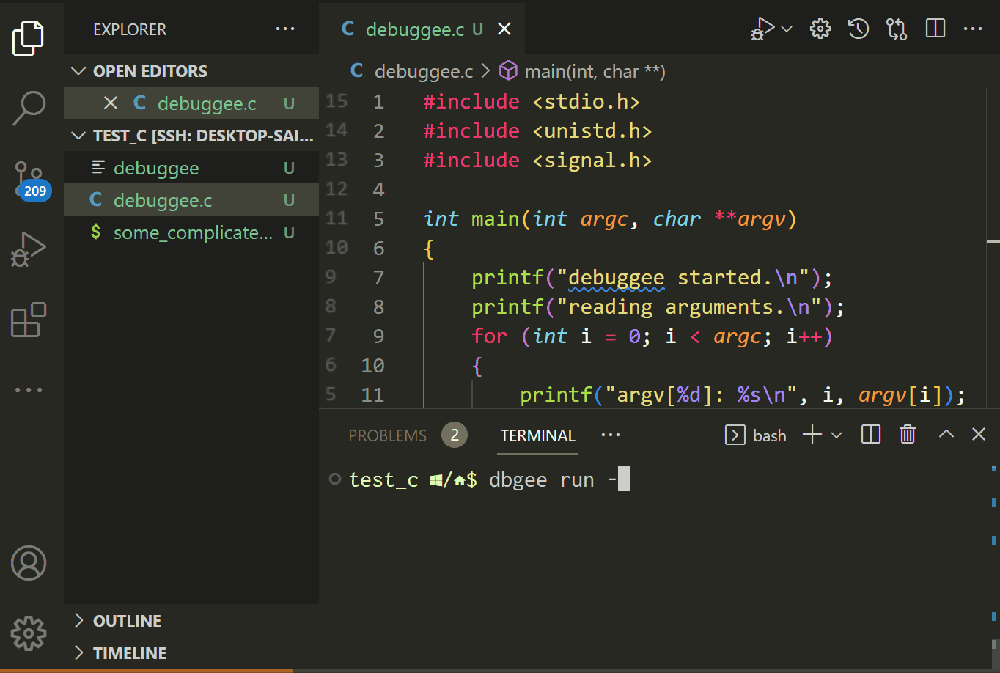
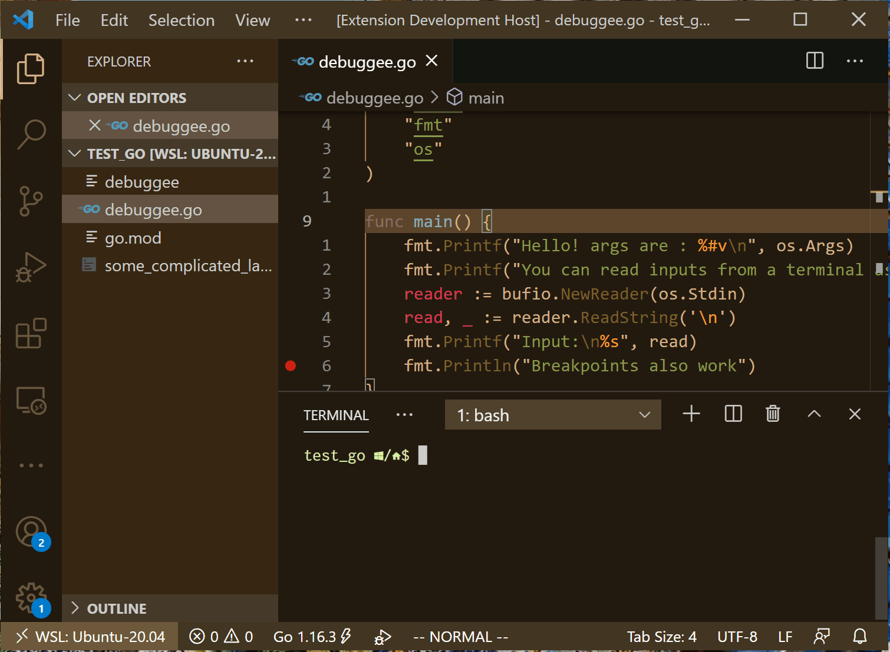
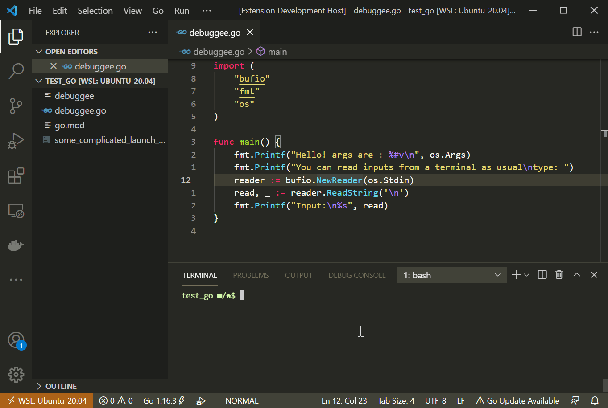

# Dbgee - the Zero-Configuration Debuggee for Debuggers



Dbgee is a handy utility that allows you to launch CLI debuggers and VSCode debuggers from the debuggee side.
Just start your program by a simple command in a terminal, and the debugger will automatically attach to it with zero configuration.
Dbgee also has the ability to preconfigure your program to automatically start a debug session no matter how the program is started.

Dbgee is very useful especially when your program requires command line arguments or redirection, or when your program is launched by some script.
In addition, Dbgee frees you from the hassle of writing `launch.json` for VSCode.

## Demos

Since the concept of Dbgee may be new to you, so here are some demos.

### Debug your program with zero configuration in Visual Studio Code

```shell
dbgee run -- ./cmd
```



### Find and attach to a process compiled from source files in the current directory, from all descendant processes of the given command

**Linux only**

```shell
dbgee run --hook-source-dir . -- ./any_run_script
```



### Configure your program to launch a debugger when it runs

```shell
dbgee set command
```



### Start a debug session with custom settings



### Launch CUI debuggers in tmux


## Supported languages and platforms

### Languages

The current supported languages are C, C++, Rust, Go, Python and any languages which Gdb, LLDB, or CodeLLDB support.

### Platforms

- Linux x64 (including WSL2). Tested and built on ubuntu-latest of GitHub action
- macOS x64. Tested and built on macos-latest of GitHub action

## Installation

There are two components, `dbgee` command and the optional VSCode extension.

### `dbgee` command

#### Linux

```shell
curl -L -O https://github.com/nullpo-head/dbgee/releases/download/cli-v0.3.0/dbgee-linux-x64.tar.gz
tar xvf dbgee-linux-x64.tar.gz
mv dbgee /usr/local/bin/ # Or anywhere in the PATH
```

#### macOS

```shell
curl -L -O https://github.com/nullpo-head/dbgee/releases/download/cli-v0.3.0/dbgee-darwin-x64.tar.gz
tar xvf dbgee-darwin-x64.tar.gz
mv dbgee /usr/local/bin/ # Or anywhere in the PATH
```

### VSCode extension

Please install "Dbgee" extension from [the marketplace](https://marketplace.visualstudio.com/items?itemName=nullpo-head.dbgee).

## Usage

### Run and attach to your program

Use `run` subcommand to launch your program and attach a proper debugger to it.

#### Launch a CLI debugger in a tmux window

By the following command, the proper debugger for your program launches in a new tmux window.

```shell
dbgee run -- ./program arg0 arg1 arg2...
```

You can manually specify your preferred debugger by the `-d` option.

```shell
dbgee run -d lldb -- ./program arg0 arg1 arg2...
```

`dbgee` launches a debugger in a new tmux window unless you run `dbgee` in an integrated terminal in VSCode.
However, you can choose other options by specifying `-t` option. Please see the help for more information.

```shell
dbgee run -t tmuxw -- ./program  arg0 arg1 arg2... # launch a debugger in a new tmux window instead of a window
```

#### Debug your program in VSCode

`dbgee` launches the given debuggee and wait for VSCode to connect to your program
if `dbgee` is running in a VSCode's integrated terminal.
Run the following command, and attach to your program in VSCode as the demo videos.

```shell
dbgee run -- ./program arg0 arg1 arg2...
```

Or, you can use `-t vscode` option to explicitly make `dbgee` wait for VSCode.

```shell
dbgee run -t vscode -- ./program arg0 arg1 arg2...
```

### Automatically attach a debugger when your program is launched

`set` subcommand will automatically attach a debugger to your program, no matter by what means it is started.
This is a very useful feature when your program is launched by some start up scripts in your development flow.
However, please note that `set` command doesn't work if you rebuild your program after you run `set`,
or when your start up scripts incur rebuild, because `set` command works by replacing your program with a wrapper script.

```shell
dbgee set ./program
./program arg0 arg1 arg2  # your program is launched, being attached by the debugger
```

Use `unset` command to stop the debugger from attaching automatically

```shell
dbgee unset ./program
```

If you specify some to launch your program, `dbgee` automatically runs `unset` after your command finishes.

```shell
dbgee set ./program -- ./some_startup_script
```
